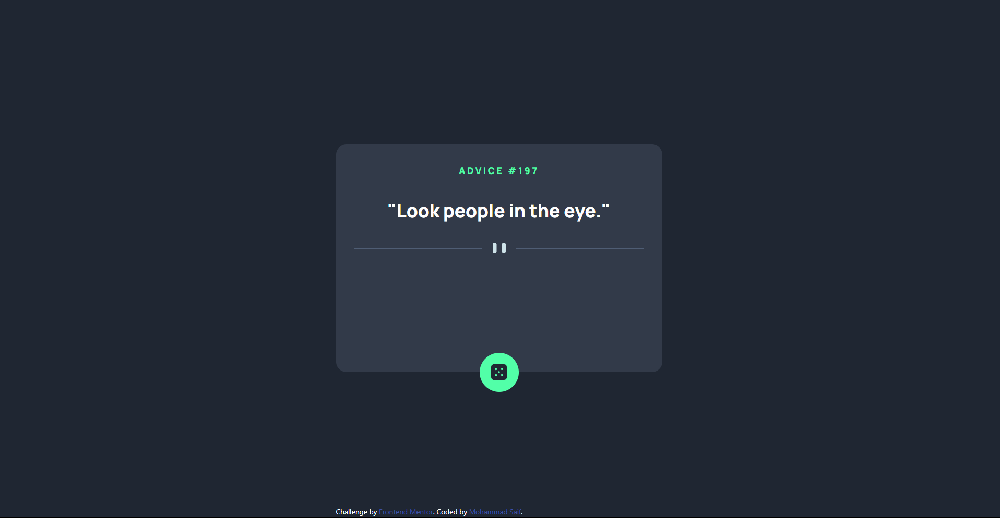
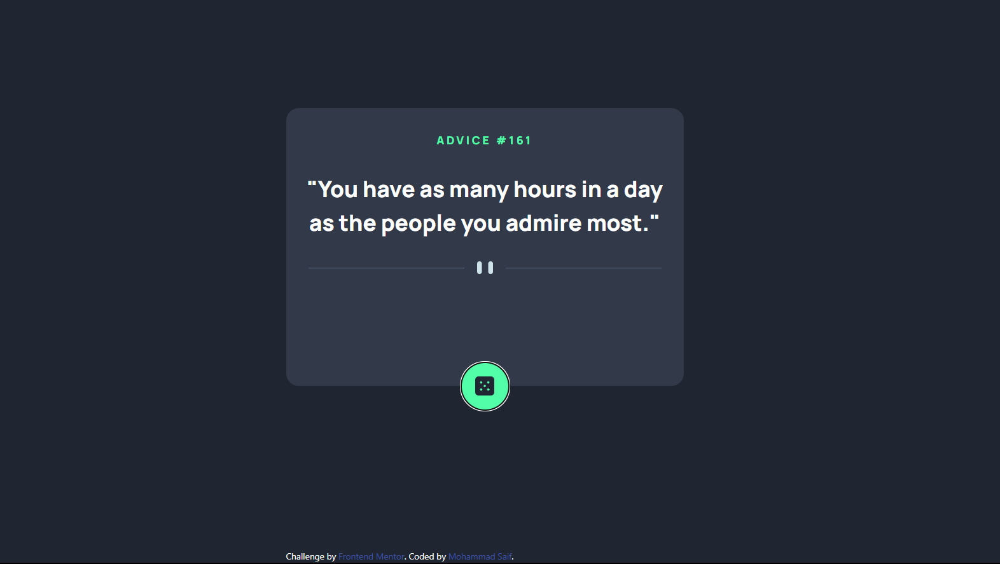

# Advice Generator

This app generates random advices using Advice slip json API.

#Tech Stack Used

- React js
- Tailwind CSS

How To Initialize on you local Machine

Step 1
`git clone https://github.com/Thebeast01/Advice-Generator.git`

Step 2
Make sure that node is installed into your system, before running the command give.

`npm install`

Step 3

`npm run dev`

# Screentshots

